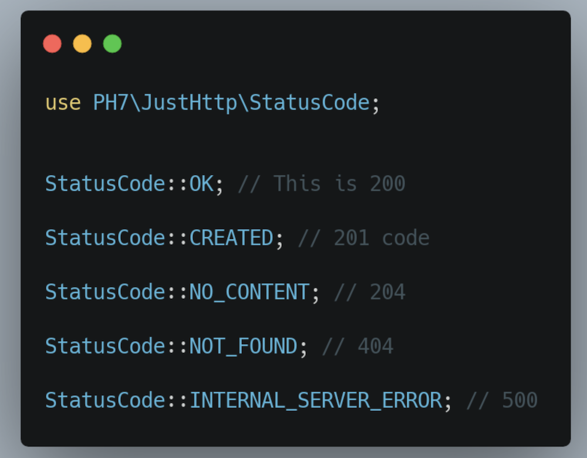

# Just HTTP Status Codes

### Just HTTP Status Codes is a great way to empower your project with clean practice 💫

## 📄 Overview

[](https://ko-fi.com/phenry)

**Simplest. Clean. Efficient.** Just what your project needs 🧹

Don't hardcode HTTP status codes. Magic numbers (hard-coded numbers) make your code hard to be read and understood.

When you have all status codes are stored in readable constants, it makes the development of your application so easy and enjoyable.

It prevents you of using the wrong HTTP status code and saves time and energy when developing an API that involves various HTTP status codes to be sent.




## 🐘 PHP Requirement

[PHP v7.3](https://www.php.net/releases/7_3_0.php) or newer.


## 🛠 Installation

```
composer require ph-7/just-http-status-codes
```

If you don't already use composer in your project, include [Composer's autoload](https://getcomposer.org/doc/01-basic-usage.md#autoloading) as below in the main index file, bootstrap or in another file that is always included in all pages.

```php
require __DIR__ . '/vendor/autoload.php';
```


## 🥳 Usage

Just use the beautiful HTTP status code you need.

Like below 👇

```php
use PH7\JustHttp\StatusCode;


StatusCode::OK; // This is 200

StatusCode::CREATED; // 201 code

StatusCode::NOT_FOUND; // 404

StatusCode::INTERNAL_SERVER_ERROR; // 500
```


## 😋 Who cooked it?

[](https://ph7.me 'Pierre-Henry Soria personal website')

[![@phenrysay][twitter-image]](https://twitter.com/phenrysay) [![pH-7][github-image]](https://github.com/pH-7)

**[Pierre-Henry Soria](https://ph7.me)**, a highly passionate, zen &amp; pragmatic software engineer 😊

️Are you enjoying it? **[Offer me a coffee](https://ko-fi.com/phenry)** and boost the software development at the same time! 💪


## ⚖️ License

**Just HTTP StatusCodes** is generously distributed under the _[MIT](https://opensource.org/licenses/MIT)_ 🎉 Enjoy!


<!-- GitHub's Markdown reference links -->
[twitter-image]: https://img.shields.io/badge/Twitter-1DA1F2?style=for-the-badge&logo=twitter&logoColor=white
[github-image]: https://img.shields.io/badge/GitHub-100000?style=for-the-badge&logo=github&logoColor=white
